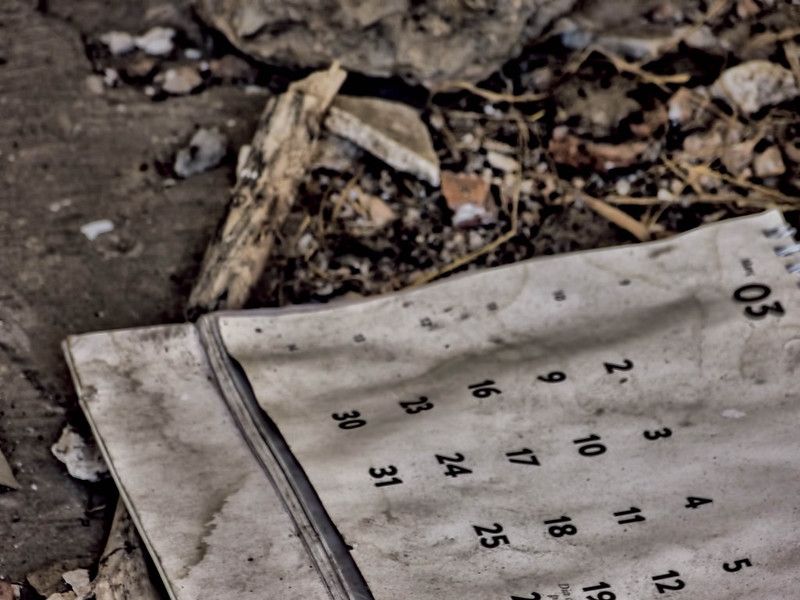

*From the acclaimed director of "Tabs vs spaces", the award-winning producer of "Vim or Emacs" and the groundbreaking screenwriter of "Should I put pineapple in my pizza?"; it comes now: "Which is the best date format?".  
Only in cinemas.*

> **TL;DR**: It is either YYYY/MM/DD or YYYY-MM-DD.

So it is either YYYY/MM/DD or YYYY-MM-DD.  
I would say more, I don't just think it is the best date format, I also think it is the only one that makes sense.  
Why?  
Because it is a convention in our culture that the [most significant figure](https://en.wikipedia.org/wiki/Significant_figures) is the leftmost one.  
This makes perfect sense since we read from left to right.  
So why do we use that convention for everything but date formats?  
I don't know. You tell me.  
Until then I will keep thinking like this.

## Thanks for reading!
